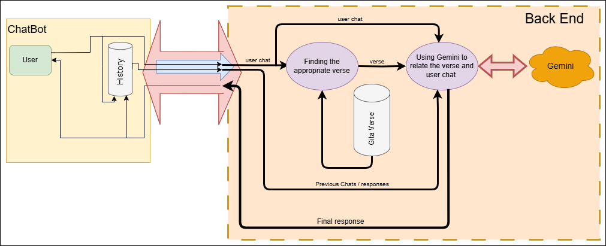

### Flow Diagram
 
### Content:
- ` back_end contains the api `
- ` front_end contains the webpage(chatbot) for testing `
- ` data contains all the files that I used to build this project `
- ` Ignore training `
### TO DO:
- ` Install all required modules by using back_end/api_p/requirements.txt `
- ` Update 'GEMINI_API_KEY' in back_end/api_p/.env with your own api-key `
- ` Find CUDA version according to that install the required version of touch (Only If you have NVIDIA GPU, else ignore) `
### Note:
- ` History must be handled in front-end `
### Input JSON Format:
```json
{
  "message": "<User msg>",
  "history": [
    {
      "role": "user",
      "content": "<User past msg>"
    },
    {
      "role": "model",
      "content": "<API past response>"
    }
  ]
}
```
### Output JSON Format:
#### Successful Response
```json
{
  "status": "success",
  "matched_verse": {
    "chapter": <Chapter_no>,
    "verse": <Verse_no.>,
    "eng_meaning": "<Gita Verse>",
    "similarity": 0.86
  },
  "gemini_response": "<Gemini Respose>"
}
```
#### Error Responses
```json
{
  "error": "<Error Msg>"
}

```


    

